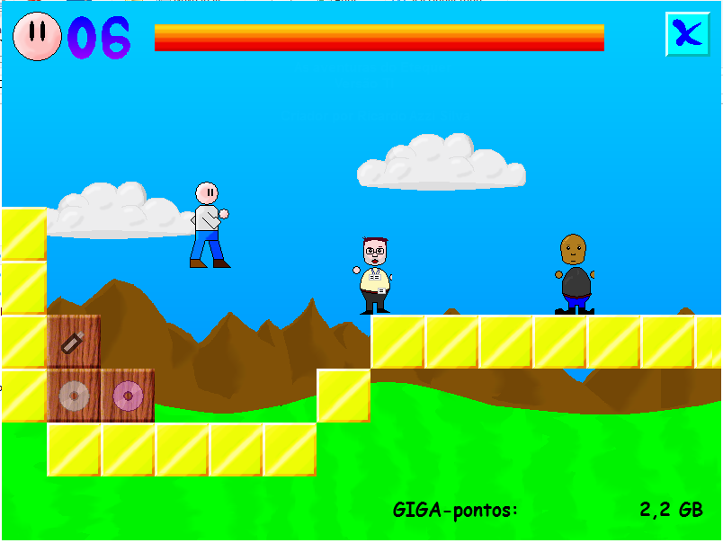
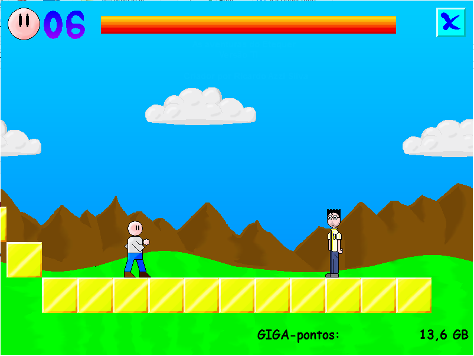
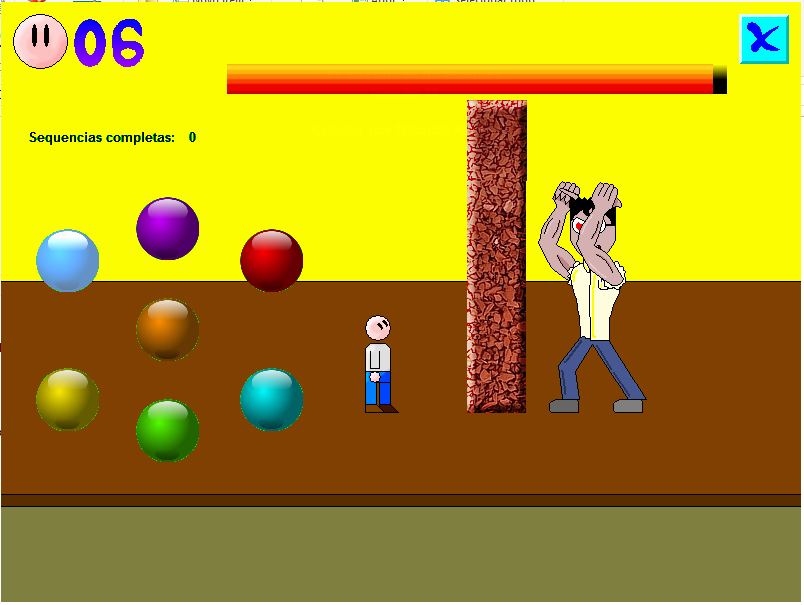
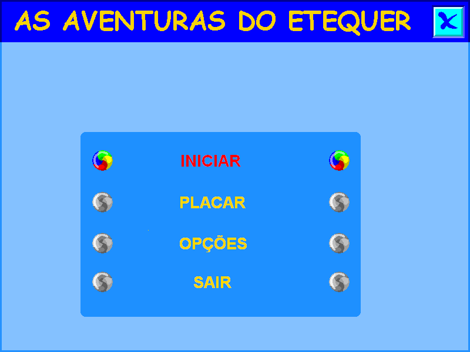
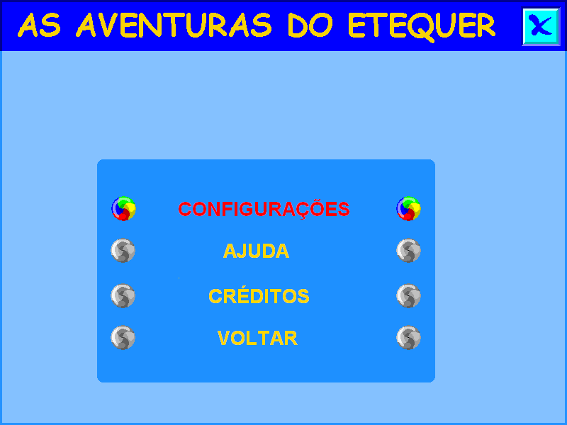
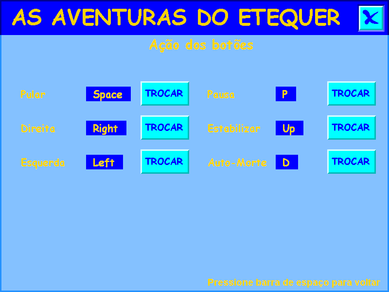
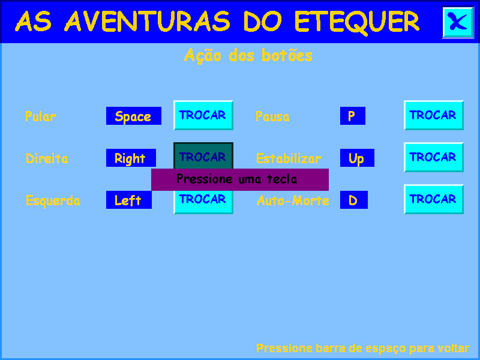
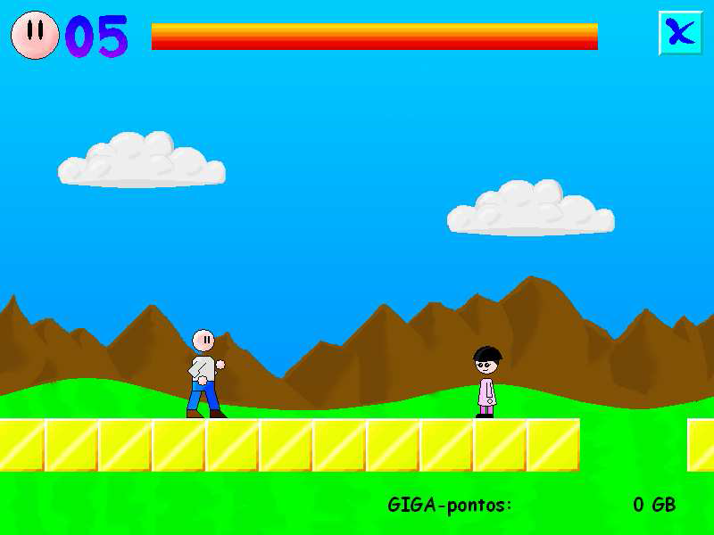
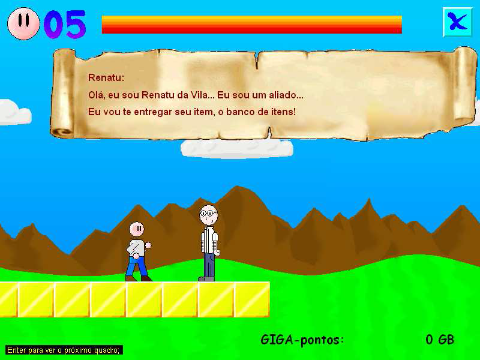

# As Aventuras do Etequer
Da série "coisas que desenvolvi quando estava no ensino técnico entre 2008 e 2009".
Neste repositório não estão contidos os vídeos e arquivos de áudio, o git não aceita arquivo excessivamente pesados, ainda estou estudando como enviá-los também ao repositório.
O projeto foi desenvolvido entre 12/03/2009 e 15/06/2009 utilizando aproximadamente 200 horas.
Contém vários bugs :)

## Resumo
O “As Aventuras do Etequer” é um jogo que mostra uma história virtual sobre as interessantes situações que aconteceram e são possíveis de acontecer algum dia com os estudantes do curso noturno de TI (Tecnologia da Informação) e com os clássicos professores do ano 2008 e dos seis primeiros meses de 2009.
O jogo é destinado para pessoas que conhecem ou podem reconhecer os professores no jogo e o prédio da ETEC LG, caso contrario o jogador não vai apreciar e entender o jogo.

## O nome
O nome do jogo tem sua origem em uma adaptação livre do de uma partícula do idioma inglês para o português. Etequer é o nome do personagem principal do jogo que tem seu nome derivado do nome da escola “ETEC”, unido àquela partícula da língua inglesa citada anteriormente, o “er”, que é usado para referir-se a uma profissão a partir de um verbo, alguns exemplos são “to hunt” que é caçar em português e “hunter” que é caçador, “to make” é criar e “maker” é criador. No caso de “Etequer” o verbo seria “to Etec”, a tradução seria algo como o ato de estudar na escola Etec.
A pronuncia de Etequer é “Etéker”, por isso ao invés de utilizar “Etecer” o nome do personagem principal foi adaptado para “Etequer”.

## A história
Basicamente o jogo é sobre um garoto que entra na Etec e conclui o curso. Para não simplificar as coisas dentro do jogo, o personagem só consegue concluir o curso derrotando determinados professores. Há no jogo três tipos de professores, aqueles a serem derrotados, os que vão atrapalhar e mesmo que derrotados voltam ao jogo e os professores aliados. Os professores do jogo são inspirados nos professores do curso de 2008/2009, todavia são apenas inspiração, não significa que sejam as mesmas pessoas. Os nomes dos professores do jogo são Roza, Marcelu da Torre, Renatu da Vila e Cleito são os professores aliados, os professores “inimigos”, os básicos são Daivisom e Ervin, apesar disso dentro dos inimigos está incluso o “Etequer do Mal”, dos professores chefes, eles são três, Muacir, Agustinho e Louis Carlos, esses professores chefes são os que devem ser derrotados para conclusão do curso, porém, no desarolar da história podem ocorrer imprevistos :)

# Como Jogar

## Instalação
A instalação do jogo é simples e comum, assim como os outros tipos de instalação você necessitará do executável da instalação, o ETEQUER.exe que ao executar-lo você terá acesso a instalação do jogo em sua maquina, a instalação é simples, se iniciar de uma tela de boas vindas, uma tela para selecionar o local de instalação, a tela de instalação e a tela que avisa que a instalação foi concluída.

## Bem vindo ao jogo
Depois de concluir a instalação do jogo você encontrará um atalho criado pelo mesmo na área de trabalho, executando esse atalho você iniciará o jogo e se deparará com a seguinte tela:

Os comandos que se usa para selecionar as opções dessa tela são as teclas do teclado para cima, para baixo que você usa para selecionar uma entre opções e também a barra de espaço que você afirmar uma escolha.
Como se pode ver há quatro opções possíveis de se selecionar, Iniciar, Placar, Opções e Sair. Selecionando a opção Iniciar você estará entrando no jogo e poderá começar a jogar, chamo a atenção para o fato do jogo não ter um menu de save/load e também o jogo não é pequeno o que automaticamente se faz recomendar que você inicie o jogo quando tiver tempo disponível para jogar-lo, assim não precisará parar na metade do jogo. Em Placar você visualiza os melhores jogadores, as melhores pontuações ocorridas no jogo ficam marcadas nesse menu, inicialmente ele vem com nomes e pontos fictícios apenas para os campos serem preenchidos, esse placar é somente local, ou seja, marcará apenas na sua maquina as pontuações dos que concluírem o jogo. A opção sair executa o mesmo que o “X” desenhado no canto superior direito da janela, ele encerra o aplicativo.

## Menu Opções
Quando no menu inicial você selecionar o item “Opções” você irá se deparar com a seguinte janela:

Esse é o menu de opções, dentro dele você encontra quatro novas opções e para escolher uma delas você usa os mesmos comandos usados no menu inicial. O botão de saída, representado no canto superior direito por um “X”, quando pressionado irá encerrar o aplicativo, porém, se você pressionar Alt + F4 você irá encerrar o menu de opções, clicando em voltar você também irá retornar para o menu principal. Entrando no menu configurações você irá se deparar com a seguinte tela:

Essa tela é a tela do menu configurações, dentro dela é possível selecionar a sua preferência em relação aos comandos do jogo, o jogo é composto por 6 comandos básicos que serão explicados mais para frente, para selecionar um novo valor para o comando você deve pressionar o botão TROCAR que se referir a função ao escrita a sua esquerda, por exemplo, no local onde se encontra escrito Direita é onde a função que faz o personagem do jogo seguir para direita, o botão que leva ele a fazer isso é o Right, que em inglês quer dizer direito, no caso das teclas do teclado Right é a seta apontando para o lado direito, um pouco mais ao lado da escrita Right você encontra o botão TROCAR clicando nele você abrirá uma janelinha no centro do menu, como mostra abaixo:

Pressione uma tecla, assim como diz a janela e quando isso por feito ela sumirá e a tecla que você tiver pressionado irá substituir a anterior dando assim a função um novo comando. Para voltar ao menu opções pressione a barra de espaço como é possível ver no canto inferior direito da tela.

De volta ao menu opções você pode ver outras duas opções que eu ainda não expliquei, a opção Créditos e a opção Ajuda, a opção Créditos irá apresentar à você um vídeo com os créditos do desenvolvimento do jogo, a opção Ajuda é a opção que explica sobre os comandos e sobre o jogo em si, dentro dela ainda há comandos para que se possa andar entre os tópicos de ajuda, pressionando o botão “+” de seu teclado você irá passar para um novo tópico de ajuda, pressionando o botão “-” você irá regressar para o tópico anterior, com espaço você volta ao menu opções.

## Jogando
No menu inicial do jogo, para iniciar o jogo você deverá selecionar a opção INICIAR, ao clicar nela aparecerá uma barra de carregamento, aguarde a conclusão dela.

Depois da tela de carregamento aparecerá uma nova tela, a tela de vídeos, nela irá passar um vídeo que deve ser interpretado pelo jogador, caso você seja um desses jogadores afobados para jogar e não se interesse nem um pouco pela história você poderá pressionar a tecla “Enter”, ela irá finalizar o vídeo, aviso ainda que nenhum dos vídeos que passarem durante o jogo são obrigatórios, todos tem a opção de corte pressionando a tecla “Enter”.

Os comandos para jogar são seis, assim como já foi dito no menu de configurações, os dois primeiros comandos são os básicos dos jogos do estilo plataforma, as setas direita e esquerda que, assim como qualquer outro comando, pode ser alterado no menu configurações assim com já foi visto, pressionando o botão direita apenas uma vez o personagem do jogo irá constantemente se mover para direita e o mesmo para esquerda, a função “estabilizar” foi criada para isso, é executada através do pressionar da seta que aponta para cima, executando ele o personagem para de se mover, para pular você usa a barra de espaço, existem ainda os comandos de Pausa e de Auto-Morte, Pausa é executado pela tecla “P” e para o jogo quando o jogador precisa ir ao banheiro, com o pressionar de “P” novamente o jogo prossegue, Auto-Morte é executado por “D”, essa função faz o jogador morrer, isso é necessários por haver situações em que o jogador não irá conseguir seguir em frente ou voltar.

Analisando a janela do jogo você pode ver diversas informações, no canto superior esquerdo você vê a cabeça do Etequer com o número 5 ao lado, isso são as suas vidas, ao lado da cabeça há uma barra quando essa barra se esvazia você perde uma vida, se você cair em um buraco também é perdido uma vida, se o jogador encostar em algum inimigo pelo lados dele ele irá perder pontos da barra de vida. No canto inferior direito você pode ver o número 0 com a escrita “GIGA-pontos” à sua esquerda, os GIGA-pontos são a pontuação do jogador, de acordo com o item que ele pega no jogo ele ganha uma pontuação. No decorrer do jogo você encontrará inimigos assim como nos típicos jogos de plataforma, por exemplo, o clássico Mario se tem os Cogumelos ambulantes que se locomovem de um lado para outro e também a tartaruga, n’As aventuras do Etequer, esses inimigos são o Etequer do mal, Daivisom e Ervin, pulando sobre ele, assim como em outros jogos você irá derrotar-los ganhando uma pontuação de acordo com o inimigo. Você também encontrará caixas com coisas dentro, para abrir-las você deverá pular sobre elas, os itens que podem ser pegos através de caixas no jogo são seis, os itens básicos de pontuação que são o CD, o DVD e o PenDrive e os itens de efeito que são o FireWall, a Estrela e a Vida, a FireWall te deixa envolvido por uma camada de fogo que permite passar pelos inimigos sem perder vida, também permite passar pelas caixas sem precisar pular sobre elas, esse item tem um tempo de duração, o item Estrela e Vida são referentes a vida do jogador, a Estrela recupera a barra de vida do jogador enquanto a Vida lhe aumenta um ponto de vida, o tem CD aumenta 0.7 GIGA-Pontos, o item DVD aumenta 4.7 e o PenDrive aumenta um valor randômica que fica entre 1.0, 2.0, 4.0 ou 8.0, a descrição dos itens é a seguinte: o CD é um cd de cor cinza, o DVD é um cd de cor roxa, o PenDrive na verdade parece mais um aparelho de MP3, mais seu plug de USB é inconfundível, a Vida é a face do Etequer, a Estrela é uma bolinha amarela e a FireWall é uma bolinha vermelha. Ao encontrar um chefe ou um aliado você terá uma conversa com ele, como no exemplo a seguir:

Assim como a instrução diz no canto inferior esquerdo da tela, você deve pressionar Enter e assim continuar a conversa até que ela se conclua.

## Chefes
Dentro do jogo há os chefes, esses chefes são determinados professores selecionados para isso, de acordo com a história interna do jogo o aluno deveria enfrentar 3 chefes, mas com imprevistos ele enfrenta 4 chefes no decorrer do jogo. São eles: Marcelu da Torre, Muacir, Agustinho e Louis Carlos. Cada chefe vem com comandos diferentes e inalteráveis.
O chefe Marcelu da Torre é o primeiro a ser enfrentado, você deve seguir uma seqüência de cores antes que ele destrua a parede em que ele esta preso, são sete cores, primeiramente essas cores irão fazer uma seqüência e você deverá repetir a seqüência pressionando os botões referente as cores da seqüência na ordem, os botões são: 7 para azul, 8 para roxo, 9 para vermelho, 5 para laranja, 1 para amarela, 2 para verde e 3 para azul celeste, quando você concluir uma seqüência você deve apertar uma tecla qualquer de comando.

O chefe Muacir é o segundo chefe a se enfrentar, os comandos dele são mais simples que o de Marcelu, você deve se esquivar dos pássaros, nuvens e outros objetos que aparecem no céu tentando te atrasar, se Muacir conseguir chegar no final primeiro que você, você perde caso contrario você ganha, para se movimentar pelo cenário você usa os botões direcionais.

O chefe Agustinho é ainda mais simples que o chefe Muacir, você deve pressionar apenas para cima e para baixo para que seu personagem se movimente. Nesse chefe você deve rebater os mísseis enviados por ele para que ele receba o dano e não você, atenção para o fato dele também rebater os mísseis.

No chefe Louis Carlos você deverá fazer uma batalha armada, onde você usa uma ShotGun e Louis Carlos usa uma metralhadora, dentro dessa batalha você deverá selecionar que tipo de ataque você pretende usar contra Louis Carlos e assim ele atacará, são três tipos de ataque que você pode dar e três tipos de ataque que Louis Carlos pode dar, é como se fosse um Jokenpô, cada ataque tem uma vantagem para com outro ataque e uma desvantagem com outro, para selecionar o ataque é simples, use os botões direcionais quando o menu aparecer e para escolher uma opção pressiona a barra de espaço. Antes de você selecionar uma das opções Louis Carlos irá falar alguma coisa que pode revelar qual movimento ele irá fazer.

## Requisitos do sistema
Para que você possa apreciar “As aventuras do Etequer” você deverá ter um
computador com as seguintes capacidades:
- 2 Gigabytes de memória RAM;
42
- 300 Megabytes livres de memória rígida;
- Um teclado com as teclas de Num Lock;
- Um monitor que suporte 800 x 600 pixels de resolução;
- Windows XP ou superior com Windows Media Player funcionando.

## Sobre os arquivos instalados
Todos os arquivos instalados no pacote As aventuras do Etequer são importantes,
eles envolvem efeitos gráficos, sonoros, banco de dados entre outras coisas, qualquer
alteração pode ser fatal, podendo assim perder as pontuações marcadas! Não mexa nos
arquivos se não souber o que esta fazendo. Caso você não tenha lido esse aviso e tenha
danificado a estrutura dos arquivos de alguma forma você deverá reinstalar o jogo no seu
computador novamente e perder todas as pontuações marcadas no seu banco de dados.
